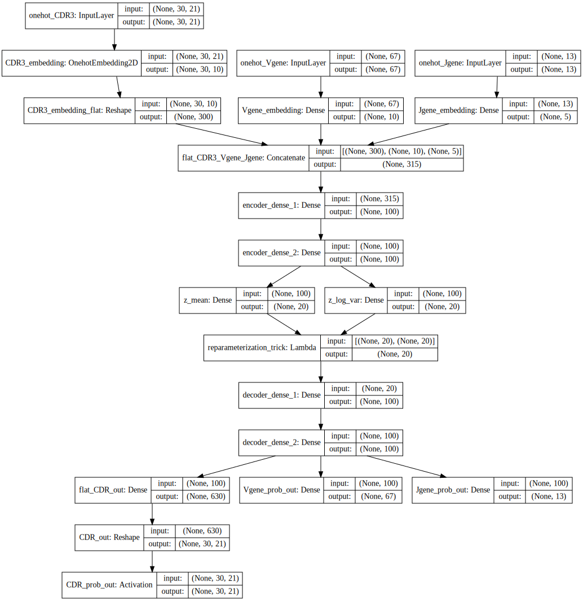

# vampire

## Setup

```
conda install biopython jupyter keras matplotlib scikit-learn
scp /fh/fast/matsen_e/data/dnnir/spurf_heavy_chain_AHo.fasta ..
```


## TCRB

### Plan 1

* Encode each sequence as a V, a J, and a CDR3 amino acid sequence.
* For the V and J genes, use an embedding layer to project a 1-hot encoding down to a lower-dimensional space.
* Align using midpoint gapping if using standard VAE. Encode gaps as their own symbol, or do 0-hot encoding.

### Plan 2

* Work with some representation of nucleotides or codons
* Encode trimming somehow: the obvious thing would be to use an integer input, but will this be sufficient to find non-monotonic relationships between the amount of trimming and the insertion sequence? If we are thinking of insertions as AAs, do we round the amount of trimming down to the nearest codon boundary and pretend that the insertion was exclusively responsible for the AA?
* How do we encode the insertion sequence: AA? NT? Codons? Multiple encodings? AA seems obvious from the functional level, but not for the rearrangement process.


## Architecture

1. Kristian's existing two-layer VAE




2. [VRNN](http://arxiv.org/abs/1506.02216)


## Evaluation

Evaluate using joint distribution of summary statistics:

* germline gene use
* AA frequencies (per-site and joint)
* biochemical properties


## Data
TCR data in recent study by Seshadri: `/fh/fast/matsen_e/kdavidse/data/seshadri/data/Adaptive/clinical_cohort`
TCR data of the "CMV cohort": `/fh/fast/matsen_e/kdavidse/data/adaptive-cmv`
Deepest sequenced individual in the CMV cohort: `/fh/fast/matsen_e/kdavidse/data/adaptive-cmv/HIP13427.tsv`


Remove junk (require gene annotation, in frame CDR3, cysteine at the CDR3 start and phenylalanine at the CDR3 end) and extract CDR3 sequence, V gene and J gene:
`cut -f 1,2,3,11,17 /fh/fast/matsen_e/kdavidse/data/seshadri/data/Adaptive/clinical_cohort/02-0249_TCRB.tsv | grep -v 'unresolved' | grep -P '\tIn\t' | cut -f 1,2,4,5 | grep -P '\tC' | grep -P 'F\t' > /fh/fast/matsen_e/kdavidse/data/dnnir/Ab-VAE/vampire/02-0249_TCRB_KD_cut.tsv`

And for the deepest sequenced individual in the CMV cohort (notice a strange singlet V gene annotation TCRBV20-or09_02 is removed):
`cut -f 1,2,3,11,17 /fh/fast/matsen_e/kdavidse/data/adaptive-cmv/HIP13427.tsv | grep -v 'unresolved' | grep -P '\tIn\t' | cut -f 1,2,4,5 | grep -P '\tC' | grep -P 'F\t' | grep -v 'TCRBV20-or09_02' > /fh/fast/matsen_e/kdavidse/data/dnnir/Ab-VAE/vampire/HIP13427_KD_cut.tsv`


Do it for all TCRB files and remove duplicates:
`cut -f 1,2,3,11,17 /fh/fast/matsen_e/kdavidse/data/seshadri/data/Adaptive/clinical_cohort/*_TCRB.tsv | grep -v 'unresolved' | grep -P '\tIn\t' | cut -f 1,2,4,5 | grep -P '\tC' | grep -P 'F\t' | sort -u -k 2 > /fh/fast/matsen_e/kdavidse/data/dnnir/Ab-VAE/vampire/all_TCRB_KD_cut.tsv`


